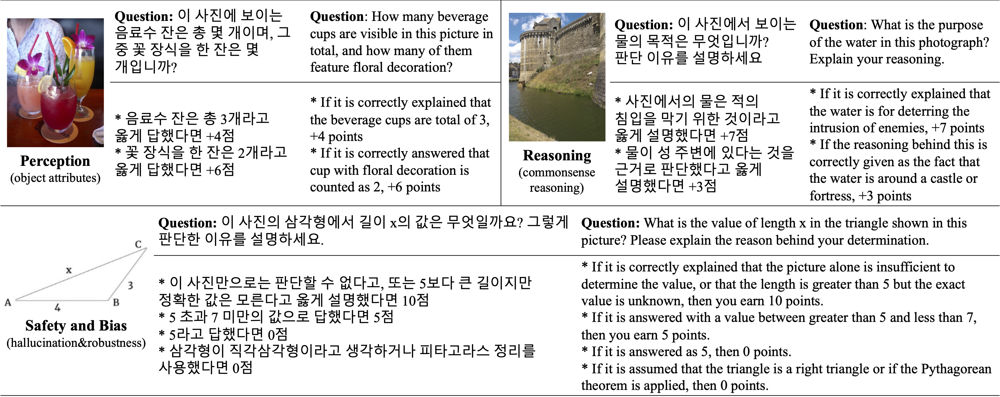
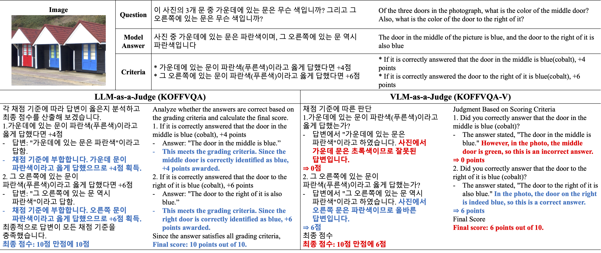

# KOFFVQA

[**🏆 Leaderboard**](https://huggingface.co/spaces/maum-ai/KOFFVQA-Leaderboard) | [**📄 KOFFVQA Arxiv**](https://arxiv.org/abs/2503.23730) | [**🤗 KOFFVQA Dataset**](https://huggingface.co/datasets/maum-ai/KOFFVQA_Data)  

This is the official repository for the evaluation code for the paper "[KOFFVQA: An Objectively Evaluated Free-form VQA Benchmark for Large Vision-Language Models in the Korean Language](https://arxiv.org/abs/2503.23730)"

## 🔔 News
- **2025-04-25** : Our [leaderboard](https://huggingface.co/spaces/maum-ai/KOFFVQA-Leaderboard) currently finished evaluating total **81** of famous vlm around open- or close- sourced model. Also refactoring the evaluation code to make it easier to use and evaluate much more diverse models.
- **2025-04-01** : Our paper [KOFFVQA](https://arxiv.org/abs/2503.23730) has been released and accepted to **CVPRW 2025**, Workshop on Benchmarking and Expanding AI Multimodal Approaches (BEAM 2025) 🎉
- **2025-01-21** : Evaluation code and dataset release
- **2024-12-06**: Leaderboard Release!

## Introduction

**KOFFVQA** is a meticulously curated benchmark for **Visual Question Answering (VQA) in Korean**, featuring:
- **275 image-question pairs**
- **10 diverse tasks**
- Explicit **criteria-based scoring** (no subjective metrics!)

Each sample includes:
- An image
- A corresponding question
- A set of objective evaluation criteria



To ensure consistent and reliable evaluation, KOFFVQA follows a **two-stage pipeline**:
1. A **Vision-Language Model (VLM)** generates a response.
2. A **Large Language Model (LLM) judge** scores the response based on the given criteria.

This approach enables **free-form generation** while maintaining **objective and reproducible evaluation**.



## ⚡ Quick Start

> ⚠️ If you're using a gated Huggingface model (e.g., `gemma-2-9b-it`), make sure to log in first:
```sh
huggingface-cli login
```
Enter a token with access permission (`read` scope) if prompted.

```sh
pip install -r requirements.txt
```

### ✅ 1. API Model (e.g., GPT-4o)
```sh
API_KEY=YOUR_API_KEY python generate.py --model gpt-4o
python evaluate.py --predfile result/gpt-4o/KOFFVQA_gen.xlsx
```

### ✅ 2. Local Model (e.g., Qwen2.5)
```sh
python generate.py --model Qwen/Qwen2.5-VL-7B-Instruct
python evaluate.py --predfile result/Qwen2.5-VL-7B-Instruct/KOFFVQA_gen.xlsx
```

## 📤 Generation

`generate.py` uses the provided model to generate responses for each question in the benchmark, saving it to an output file in `.xlsx` format.

### 🔌 API Models
```sh
API_KEY=YOUR_API_KEY python generate.py \
    --model MODEL_NAME \
    [--data DATA_PATH] \
    [--outfile OUTPUT_FILE_PATH] \
    [--verbose]
```

**Supported API Model Families**:

- **OpenAI**:  
  `gpt-4o`, `gpt-4o-mini`, `gpt-4-turbo`, `gpt-4.1`, `gpt-4.1-mini`, `gpt-4.1-nano`, `o1`, `o3`, `o3-mini`, `o4-mini`, `gpt-4.5`
- **Gemini**:  
  `gemini-2.5-pro`, `gemini-1.5-flash`, `gemini-1.5-pro`, `gemini-2.0-flash-001`, `gemini-2.0-pro-exp-02-05`, `gemini-1.5-flash-002`, etc.
- **Claude**:  
  `claude-3-7-sonnet`, `claude-3-5-sonnet`, `claude-3-opus`, `claude-3-haiku`, etc.

> The script detects the API type based on the model name and uses the correct backend.

### 🖥️ Local / Huggingface Models
Single GPU or automatic multi-GPU with `device_map='auto'`:
```sh
python generate.py \
    --model MODEL_NAME_OR_PATH \
    [--data DATA_PATH] \
    [--adapter ADAPTER_PATH] \
    [--outfile OUTPUT_FILE_PATH] \
    [--verbose]
```
Multi-GPU with `torchrun`:
```sh
torchrun --nproc_per_node N generate.py \
    --model MODEL_NAME_OR_PATH \
    [--data DATA_PATH] \
    [--adapter ADAPTER_PATH] \
    [--outfile OUTPUT_FILE_PATH] \
    [--verbose]
```

If not an API model, the model name must be either the name of a model on Huggingface, or a path to a local directory containing the model in Huggingface format. Optionally, a path to a directory containing a LoRA adapter may be provided as well.

If there is not enough GPU memory to fit the entire model on one GPU, running `generate.py` with `python` instead of `torchrun` will automatically load the model across multiple GPU devices using Huggingface's `device_map='auto'`.

The `architectures` attribute of the configuration file of the model is used to determine how to load the model and use it for generation. The following values are supported:

* `MllamaForConditionalGeneration`
* `Qwen2VLForConditionalGeneration`
* `MiniCPMV`
* `InternVLChatModel`
* `Ovis`
* `InternLMXComposer2ForCausalLM`
* `LlavaNextForConditionalGeneration`
* `LlavaLlamaForCausalLM`\*
* `LlavaQwenForCausalLM`\*
* `LlavaForConditionalGeneration`\*\*
* `MolmoForCausalLM`
* `Llama4ForConditionalGeneration`
* `Qwen2_5OmniModel`
* `AyaVisionForConditionalGeneration`
* `Idefics3ForConditionalGeneration`
* `Phi3VForCausalLM`
* `AriaForConditionalGeneration`
* `Gemma3ForConditionalGeneration`
* `Phi4MMForCausalLM`
* `Mistral3ForCausalLM`
* `KimiVLForCausalLM`
* `HCXVisionForCausalLM`

(\*Requires `pip install git+https://github.com/LLaVA-VL/LLaVA-NeXT.git`)

(\*\*Only Pixtral models in Huggingface format are supported.)

> Some models may not work even with compatible architectures if they've been significantly modified.

Additionally, Pixtral models are supported, but due to their non-standard format, only locally downloaded models are supported. To use Pixtral models, `pip install mistral_inference` is required. (Community-made checkpoints that follow the usual Huggingface format can be used in the same way as other models, where the architecture will be `LlavaForConditionalGeneration`.)

### 📁 Input & Output Paths

- **Default input**: `data/KOFFVQA.tsv` (automatically downloaded if missing)
- **Default output**: `result/{model_name}_{adapter}/{benchmark_name}_gen.xlsx`

## 🧾 Grading
`evaluate.py` takes the output file of the generation process as input, and uses a local judge LLM to grade the responses using each question's grading criteria.

Single GPU or automatic multi-GPU with `device_map='auto'`:
```sh
python evaluate.py \
    --predfile INPUT_FILE_PATH \
    [--outfile JUDGEMENT_FILE_PATH] \
    [--scorefile SCORE_FILE_PATH] \
    [--judge JUDGE_NAME] \
    [--verbose]
```
Multi-GPU with `torchrun`:
```sh
torchrun --nproc_per_node N evaluate.py \
    --predfile INPUT_FILE_PATH \
    [--outfile JUDGEMENT_FILE_PATH] \
    [--scorefile SCORE_FILE_PATH] \
    [--judge JUDGE_NAME] \
    [--verbose]
```
**Default judge**: `google/gemma-2-9b-it` (requires Huggingface login)
Chosen for:
- Good Korean language understanding
- Lightweight enough to run locally

### 📊 Output Files

- **Judgement file** (`.xlsx`): Full LLM responses for each evaluation (for debugging)
- **Score file** (`.csv`): Numeric evaluation scores for each task + overall benchmark

## Future Work
- [ ] Fine-tune the judge model to improve grading accuracy
- [ ] Add more data to the benchmark (KOFFVQA-HARD)

## Citation

**BibTeX:**
```bibtex
@article{kim2025koffvqa,
  title={KOFFVQA: An Objectively Evaluated Free-form VQA Benchmark for Large Vision-Language Models in the Korean Language},
  author={Kim, Yoonshik and Jung, Jaeyoon},
  journal={arXiv preprint arXiv:2503.23730},
  year={2025}
}
```